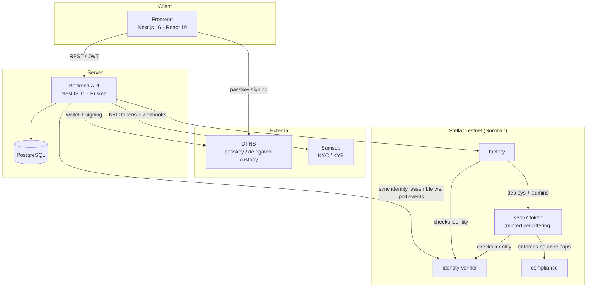

# Bunkr

> **Trade finance without the banks.**
> A decentralized trade finance marketplace on Stellar.

Bunkr connects two sides of a broken market. Shipping companies unlock instant
working capital by **tokenizing verified freight receivables** — drawing capital
the moment a raise fills, while the freight is still en route. KYC-verified
investors can earn **2–9% yield from real-world shipping**, not synthetic yield,
settled in **$USDC**.

Every token is a permissioned, identity-gated **SEP-57 compliant** asset backed
1:1 by a verified freight receivable. Transfers to unverified wallets revert;
mint and burn require signed admin permits; a compliance contract enforces
per-token balance caps on every hop. Custody is handled by passkeys via DFNS —
no seed phrase, no browser extension.

The full business lifecycle — verification, tokenization, funding, settlement,
and claims — runs on-chain today, live on **Stellar Testnet**.

---

## Deployments

### Smart contracts (Stellar Testnet)

| Contract              | Purpose                                                                                        | Address                                                                                                                                                                 |
| --------------------- | ---------------------------------------------------------------------------------------------- | ----------------------------------------------------------------------------------------------------------------------------------------------------------------------- |
| **identity-verifier** | On-chain KYC/KYB registry the token consults before any transfer.                              | [`CBAJGMXC5RIYTYFFBZF3KMFCY7DGIN7XSNZJXQXIGEZMURJCQVHXL3A4`](https://stellar.expert/explorer/testnet/contract/CBAJGMXC5RIYTYFFBZF3KMFCY7DGIN7XSNZJXQXIGEZMURJCQVHXL3A4) |
| **compliance**        | Rules engine enforcing per-token maximum balance caps on creates and transfers.                | [`CBVH7ETC3LZAEL5SNRTWS62IZVSNG2TSAESQW4L7YCGX5UEFYWD7UKGR`](https://stellar.expert/explorer/testnet/contract/CBVH7ETC3LZAEL5SNRTWS62IZVSNG2TSAESQW4L7YCGX5UEFYWD7UKGR) |
| **factory**           | Orchestrates the full RWA offering lifecycle and holds USDC + RWA tokens in escrow end-to-end. | [`CBUNBDBR37C4JDBVUK6EYSLFGNFSA54JREJ7L3X3NTXGWY3OV5JTL5HI`](https://stellar.expert/explorer/testnet/contract/CBUNBDBR37C4JDBVUK6EYSLFGNFSA54JREJ7L3X3NTXGWY3OV5JTL5HI) |

> The **sep57** token contract is uploaded as WASM and is not deployed as a
> single instance — the factory mints a fresh permissioned token per offering on
> demand.

### Website

**Live app:** https://bunkr-stellar.vercel.app/

---

## High-Level Architecture

Bunkr is a three-tier application: a Next.js frontend, a NestJS backend that acts
as the bridge to identity/custody providers and the chain, and a Soroban
contract workspace on Stellar.



**How the pieces fit together**

- **Frontend** — the marketplace UI. Users authenticate with passkeys (DFNS),
  complete KYC/KYB, tokenize receivables, buy shares, and claim payouts.
- **Backend** — the orchestration layer. It provisions DFNS wallets, issues app
  JWTs, runs the Sumsub KYC/KYB flow, syncs verification results to the
  `identity-verifier` contract, assembles Soroban transactions for the RWA flow,
  and polls chain events to keep the database in sync.
- **Contracts** — the enforcement layer. The `factory` is the admin of every
  `sep57` token it deploys and holds all USDC + RWA tokens in escrow. Every token
  consults `identity-verifier` (both sides of a transfer must be verified) and
  `compliance` (per-token balance caps) on every state change.

**The lifecycle (all on-chain today)**

1. **Verify** — KYB for shippers, KYC for investors, recorded on-chain via
   `identity_verifier::set_identity`.
2. **Tokenize** — an approved invoice becomes its own permissioned token;
   interest and fees escrow up front (`factory::create_rwa_token`).
3. **Fund** — investors buy shares 1:1 with USDC; when the raise fills, the
   shipowner draws the capital (`factory::buy_shares` → `collect_fund`).
4. **Settle** — the customer pays; principal returns to the pool
   (`factory::settle_debt`).
5. **Claim** — tokens burn; investors collect principal + interest
   (`factory::claim`).

---

## Tech Stack

| Layer                  | Stack                                                                                                                                                  |
| ---------------------- | ------------------------------------------------------------------------------------------------------------------------------------------------------ |
| **Contracts**          | Rust · Soroban SDK 25 · Stellar CLI · `wasm32v1-none` target                                                                                           |
| **Backend**            | NestJS 11 · TypeScript (strict) · Prisma 7 · PostgreSQL · DFNS SDK · Sumsub · Stellar SDK · Swagger · pnpm                                             |
| **Frontend**           | Next.js 16 · React 19 · TypeScript · Tailwind CSS 4 · shadcn/Radix UI · TanStack Query · Auth.js (NextAuth v5) · DFNS browser SDK · Stellar SDK · pnpm |
| **Scripts**            | Node/TypeScript helpers for ed25519 mint/burn permit signing                                                                                           |
| **Identity & custody** | DFNS (delegated passkey custody) · Sumsub (KYC/KYB)                                                                                                    |
| **Chain**              | Stellar Testnet (Soroban) · USDC settlement                                                                                                            |

---

## Repository Structure

```
sep57/
├── contract/     # Soroban workspace — compliance, identity-verifier, sep57, factory
├── backend/      # NestJS API — auth, DFNS, Sumsub, blockchain bridge, RWA, events
├── frontend/     # Next.js app — landing page + marketplace dashboard
└── scripts/      # Off-chain helpers (ed25519 permit signing)
```

Each subproject has its own `README.md` / `AGENTS.md` with deeper documentation.

---

## Running Locally

### Prerequisites

- **Node.js** 20+ and **pnpm**
- **Rust** with the `wasm32v1-none` target and the **Stellar CLI** (`stellar`) — for the contracts
- **PostgreSQL** 15+ (or Docker) — for the backend
- Accounts / credentials for **DFNS** and **Sumsub** (backend + frontend integrations)

### 1. Contracts (optional — already deployed on testnet)

The three contracts are already deployed (see [Deployments](#deployments)). Only
build and redeploy if you want your own instances.

```bash
cd contract
cp .env.example .env          # set SOURCE_ACCOUNT, NETWORK=testnet, addresses
make build                    # stellar contract build

# deploy + initialize (uses .env)
make deployIdentity
make deployCompliance
make deployFactory
make uploadSEP57
make initializeIdentity
make initializeCompliance
make initializeFactory

# regenerate the TypeScript bindings consumed by backend + frontend
make bindings
```

### 2. Backend

```bash
cd backend
cp .env.example .env          # fill DATABASE_URL, DFNS, Sumsub, JWT, Stellar admin secrets
pnpm install

# database (or use docker-compose for postgres + backend)
npx prisma migrate dev
npx prisma db seed

pnpm start:dev                # → http://localhost:2000  (Swagger at /api/v1/docs)
```

> Prefer Docker? `docker compose up` in `backend/` starts PostgreSQL (port 5433)
> and the API together.

### 3. Frontend

```bash
cd frontend
cp .env.example .env          # set NEXT_PUBLIC_BACKEND_URL, DFNS org/rpId, AUTH_SECRET
pnpm install

pnpm dev                      # → http://localhost:3000
```

### Default ports

| Service     | URL                                             |
| ----------- | ----------------------------------------------- |
| Frontend    | http://localhost:3000                           |
| Backend API | http://localhost:2000 (Swagger: `/api/v1/docs`) |
| PostgreSQL  | localhost:5433                                  |

---

_A research prototype on Stellar Testnet. Not investment advice._
