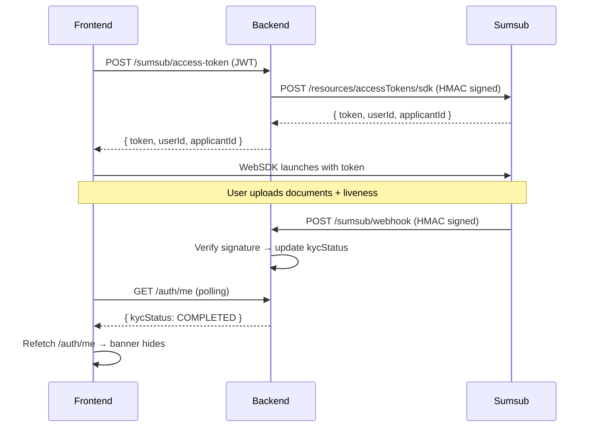
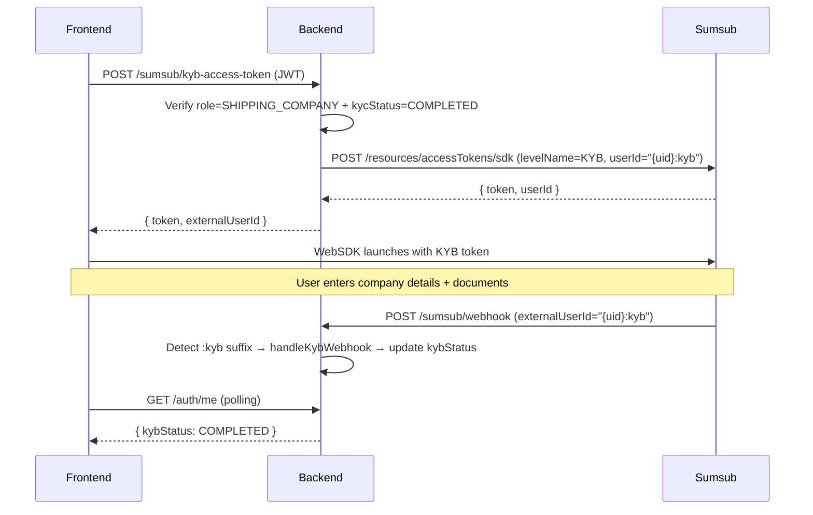

# Sumsub KYC/KYB Frontend Integration

How the Next.js frontend integrates with [Sumsub](https://sumsub.com/) via the WebSDK to let users complete identity verification (KYC) and business verification (KYB) in-app.

---

## 1. What the user sees

### Banner (`/app`)

When a signed-in user has `kycStatus !== 'COMPLETED'`, a non-intrusive banner appears below the navbar:

- **NOT_STARTED / INIT** (amber): "Complete your KYC to get full access to the app." → "Verify now"
- **PENDING** (blue): "Your KYC is under review."
- **REJECTED / ON_HOLD** (red): "Your KYC verification was not approved." → "Retry verification"

Clicking "Verify now" / "Retry verification" routes to `/app/profile/kyc`.

The banner can be dismissed per-user (stored in `localStorage`); it auto-clears once `COMPLETED`.

### KYC page (`/app/profile/kyc`)

Launches the Sumsub WebSDK widget inside a bordered container set to `height: 85vh` for a better viewing experience. The SDK handles the entire document-upload + liveness flow. The page shows:

- A loading state while fetching the Sumsub access token.
- An error state if the token request fails.
- A success state if `kycStatus === 'COMPLETED'`.
- A rejection notice + retry UI if the user was previously rejected.
- Live status polling after the SDK signals an applicant status change.

### Profile page (`/app/profile`)

Displays the current `KYC status` with a color-coded badge and a "Verify now →" link when not yet completed.

---

## 2. Data flow



---

## 3. Key files

```
frontend/
├── lib/api.ts                                    # sumsubApi.getAccessToken(), KycStatus type
├── auth.ts                                       # kycStatus propagated through NextAuth JWT/session
├── types/next-auth.d.ts                          # KycStatus added to Session/User/JWT
├── components/app/kyc-banner.tsx                  # Banner below navbar
├── components/app/app-shell.tsx                   # Renders <KycBanner /> after <AppNavbar />
└── app/app/(protected)/profile/kyc/
    ├── layout.tsx                                 # Metadata (noindex)
    └── page.tsx                                   # Sumsub WebSDK launcher
```

---

## 4. API client

`lib/api.ts` exports:

```ts
export type KycStatus =
  | "NOT_STARTED" | "INIT" | "PENDING"
  | "COMPLETED"   | "REJECTED" | "ON_HOLD"

export const sumsubApi = {
  getAccessToken: (accessToken, sessionId?, applicantId?) =>
    req<SumsubAccessToken>("/sumsub/access-token", {
      method: "POST",
      headers: bearer(accessToken),
      body: JSON.stringify({ sessionId, applicantId }),
    }),
}
```

---

## 5. WebSDK integration

```tsx
import SumsubWebSdk from "@sumsub/websdk-react"

<SumsubWebSdk
  accessToken={token}
  expirationHandler={async () => {
    const fresh = await sumsubApi.getAccessToken(accessToken)
    return fresh.token
  }}
  config={{ lang: "en" }}
  options={{ addViewportTag: false, adaptIframeHeight: true }}
  onMessage={(type, payload) => { /* status change → refetch /auth/me */ }}
  onError={(error) => { toast.error(error.message) }}
/>
```

### WebSDK event messages handled

| Event                                      | Action                                                    |
| ------------------------------------------ | --------------------------------------------------------- |
| `idCheck.onApplicantSubmitted`             | Start polling `/auth/me`                                  |
| `idCheck.onApplicantStatusChanged`         | Poll `/auth/me` for updated `kycStatus`                   |
| `idCheck.onApplicantVerificationCompleted` | Poll `/auth/me` — should become `COMPLETED` or `REJECTED` |

The backend webhook (not the SDK) is the source of truth for `kycStatus`. The frontend polls `/auth/me` every 5s (up to 6 attempts) after a status-change event to pick up the webhook-driven DB update.

---

## 6. NextAuth

`kycStatus` is propagated through the NextAuth session:

1. **Login**: `use-auth-flow.ts` passes `kycStatus` from the BE login response to `signIn("dfns", { kycStatus, … })`.
2. **JWT callback**: seeded into the token on initial sign-in (`token.kycStatus = user.kycStatus`).
3. **Session callback**: exposed as `session.user.kycStatus`.
4. **Types**: `KycStatus` added to `Session.user`, `User`, and `JWT` in `types/next-auth.d.ts`.

> The JWT-cached `kycStatus` is a snapshot from login. The live value comes from the `me` query (`authApi.me`). The banner and KYC page both use the query result with the JWT value as a fallback.

---

## 7. Permissions-Policy header

If you add a CSP or `Permissions-Policy` header to your Next.js config, you must allow the Sumsub iframe to use the camera/microphone:

```
Permissions-Policy: camera=(self "https://api.sumsub.com"), microphone=(self "https://api.sumsub.com")
```

Without this, the WebSDK's liveness/document capture will fail with "Permission denied".

---

## 9. KYB — Business Verification (Shipping Companies)

KYB is a second verification tier for `SHIPPING_COMPANY` users, run **after** KYC completes. It uses a separate Individuals level (`kyb_registry`) — same level type as KYC but with different checks configured in the Sumsub Dashboard. This avoids the paid Companies/Registry-and-AML-Check feature.

### KYB banner

When a `SHIPPING_COMPANY` user has `kycStatus === 'COMPLETED'` but `kybStatus !== 'COMPLETED'`, a KYB-specific banner appears (same component as KYC banner, with KYB messaging and a link to `/app/profile/kyb`).

### KYB page (`/app/profile/kyb`)

Same WebSDK pattern as the KYC page, but:

- Calls `sumsubApi.getKybAccessToken(accessToken)` instead of `getAccessToken`.
- No investment questionnaire phase — goes straight to the WebSDK.
- Guards: redirects to KYC page if `kycStatus !== 'COMPLETED'`.

### Profile page updates

The profile page shows a `KYB status` badge (in addition to `KYC status`) for shipping company users, plus a business info card with company name, registration number, and country (populated from the KYB webhook).

### Data flow



### Key files (KYB additions)

```
frontend/
├── lib/api.ts                    # KybStatus type, KYB_STATUS_LABELS, sumsubApi.getKybAccessToken()
├── auth.ts                       # kybStatus propagated through NextAuth
├── types/next-auth.d.ts          # KybStatus added to Session/User/JWT
├── components/app/kyc-banner.tsx  # KYB banner logic
├── app/app/(protected)/profile/kyb/page.tsx  # KYB WebSDK page
└── app/app/(protected)/profile/page.tsx      # KYB badge + business info
```

---

## 10. Notes

- The theme is light-only (`forcedTheme="light"` in `ThemeProvider`), so the WebSDK `config.theme` is left unset (auto-selects light).
- The `@sumsub/websdk-react` package (v2.6.3+) is the React wrapper for WebSDK 2.0.
- Token expiration is handled by `expirationHandler`, which fetches a fresh token from the backend.
- **Email pre-fill**: The backend passes `applicantIdentifiers: { email }` in the access token request so the WebSDK skips the "enter email" step and pre-fills it automatically.
- **Iframe height**: The SDK container uses `style={{ height: "85vh" }}` to give the iframe enough vertical space for the full verification flow.
